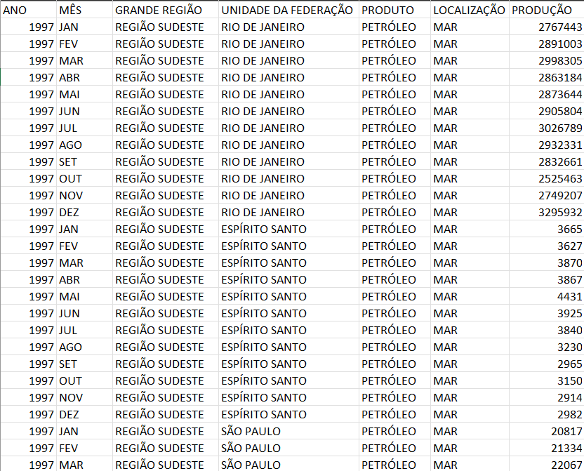

# Analise de DataFrame

## Objetivo

O script deverá ser capaz de:

- Realizar o Download de um arquivo .csv
- O usuário selecionará o Ano a ser analisado
- O programa retornará a quantidade de petróleo produzida no ano em questão

### Desenvolvido com:

- Python
- Python requests
- Pandas 1.5.3

## Autor

@gio.schardong
